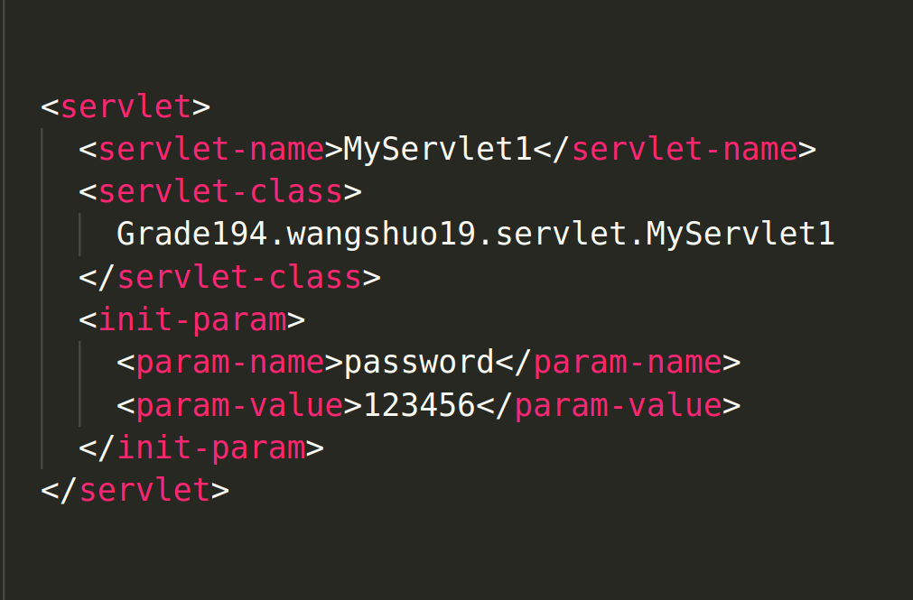

servlet | web.xml 配置文件 全部标签

<!-- more --> 

## servlet

- servlet 表明是对一个 servlet 进行配置 注：只是配置 简单serlvet （三种servlet中的一种）

- servlet-name 为一个“名字“，唯一标识这个serlvet。在一个web.xml文件中，这个”名字“是唯一的。在后面做映射mapping等等会使用到

- servlet-class 是指明这个serlvet的class文件对应的位置（即serlvet的位置）

- init-param

  是配置这个serlvet的初始化参数。一个servlet标签可以有多个 init-param 标签,一个中只能有一对 param-name 和 param-value 标签

  - 在 servlet 中，调用 init 方法的 config 参数的 getInitParameter 方法来获取此 servlet 的初始化参数
  - 在 JSP 中，调用 config 内置对象的 getInitParameter 方法来获取。

## filter

filter ：注册一个监听器。 表示这是一个filter(监听器) - 特殊的servlet

filter : 指定监听器的位置（就是classes文件的位置）

init-param : 同样的，也有和初始化参数相关的标签。这里就不进行列举了。

## servlet-mapping

- servlet-mapping 表明是对一个servlet做一个映射（mapping）
- servlet-name 同上文相近，表示要配置映射的servelt ”名字“
- url-pattern 指定servlet的映射路径，即访问servlet的名称。（向这个servlet发送请求的路径

## filter-mapping

- filter-mapping、filter-name 标签参考上一个标签
- url-pattern 和上面的基本相同。同时部分有所不同。
- servlet-name：指定过滤器所拦截的Servlet名称。
- dispatcher :

### 1. 配置 url-parttern 的简单规则

1. <url-pattern/> 作用与所有web资源：<url—pattern>/*</url-pattern>。则客户端请求访问任意资源文件时都要经过过滤器过滤，通过则访问文件，否则拦截
2. 作用于某一文件夹下所有文件：<url—pattern>/dir/*</url-pattern>
3. 作用于某一种类型的文件：<url—pattern>*.扩展名</url-pattern>。比如<url—pattern>*.jsp</url-pattern>过滤所有对jsp文件的访问请求。
4. 作用于某一文件夹下某一类型文件：<url—pattern>/dir/*.扩展名</url-pattern>
5. 如果一个过滤器需要过滤多种文件，则可以配置多个<filter-mapping>，一个mapping定义一个url-pattern来定义过滤规则。

### 2. dispatcher 的几个数值

1. FORWARD:表示当前过滤器只会由一个Servlet通过RequestDispatcher的forward()完成的跳转进行拦截
2. INCLUDE：表示当前过滤器只会由一个Servlet通过RequestDispatcher的include()完成的跳转进行拦截
3. REQUEST:表示当前的过滤器只会拦截普通请求，但对forward（）和include()的跳转不进行拦截。默认值。
4. ERROR： 表示当跳转到指定的错误处理页面时，这个跳转请求会被当前的过滤器拦截。
5. 这四种dispatcher方式可以单独使用，也可以组合使用，配置多个 < dispatche></dispatcher> 即可。

## context-param

- context-parme 配置当前项目的上下文初始化参数。在一个web.xml文件中，可以有多个context-pararm标签。 同时context-param标签外面不能嵌套标签 （在当前servlet的所用项目都可以访问到）
- param-name : 配置一个上下文初始化参数的”名字“
- param-value : 配置一个上下文初始化参时的“值”。和上文是相对应的

- 在页面中：${initParam.contextConfigLocation}
- Servlet中：String paramValue=getServletContext().getInitParameter("contextConfigLocation")

## error-page

- error-page 表明这是配置一个错误页面。一个web.xml标签可配置多个，处理不同的错误
- error-code : 出现的错误代码，如

##  session-config

- session-config 这是一个对session的配置
- session-timeout 配置session 的生命周期，默认是30分钟