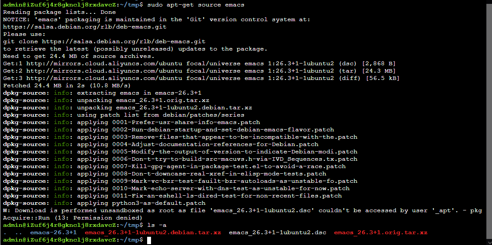
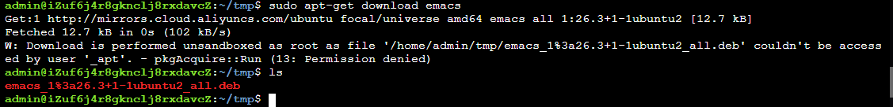

(๑•̀ㅂ•́) ✧ APT 命令详解

<!-- more -->

## 简介

apt-get 命令适用于 deb 包管理式的 Linux 操作系统（Debian、Ubuntu等），主要用于自动从互联网软件仓库中搜索、下载、安装、升级、卸载软件或操作系统。

> **高级打包工具**（英语：**Advanced Packaging Tools**，缩写为**APT**）是[Debian](https://zh.wikipedia.org/wiki/Debian)及其派生的[Linux软件包](https://zh.wikipedia.org/wiki/软件包)管理器。APT可以自动下载，配置，安装二进制或者源代码格式的[软件包](https://zh.wikipedia.org/wiki/软件包)，因此简化了[Unix](https://zh.wikipedia.org/wiki/Unix)系统上管理软件的过程。APT最早被设计成[dpkg](https://zh.wikipedia.org/wiki/Dpkg)的前端，用来处理[deb](https://zh.wikipedia.org/wiki/Deb)格式的软件包。现在经过APT-RPM组织修改，APT已经可以安装在支持[RPM](https://zh.wikipedia.org/wiki/RPM套件管理員)的系统管理[RPM](https://zh.wikipedia.org/wiki/RPM套件管理員)包。
>
> -- 来自维基百科

下面主要介绍一些基本用法，和我个人的使用经历

## 搜索软件


在安装软件前，你首先要在 apt 的官方仓库中搜索软件，从而确定你要安装的软件名称

```shell
sudo apt-cache search <KeyPackageName>
```

比如，我这里要使用 apt 来安装 JDK

在 apt 的仓库中，jdk 并不是就称为 jdk，因此，如果你直接来通过下面的命令来安装 JDK，

```bash
➜  ~ sudo apt-get install jdk
正在读取软件包列表... 完成
正在分析软件包的依赖关系树       
正在读取状态信息... 完成       
E: 无法定位软件包 jdk
```

会报上面的错误

```bash
➜  ~ sudo apt-cache search jdk
default-jdk-headless - Standard Java or Java compatible Development Kit (headless)
default-jre - 标准 Java 或兼容 Java 的运行环境
default-jre-headless - 标准 Java 或兼容 Java 的运行环境（headless）
openjdk-11-jre - OpenJDK Java 运行时环境，使用 Hotspot JIT
default-jdk - Standard Java or Java compatible Development Kit
default-jdk-doc - Standard Java or Java compatible Development Kit (documentation)
openjdk-11-dbg - Java runtime based on OpenJDK (debugging symbols)
openjdk-11-doc - OpenJDK Development Kit (JDK) documentation
openjdk-11-jdk - OpenJDK Development Kit (JDK)
......
```

以 终端输出的第一行为例，**default-jdk-headless** 是软件的名字，后面的内容是软件的简短介绍

想要看到更加详细的介绍，可使用下面的命令

```bash
apt-cache show <PackageName>
```

默认是列出源中所有的版本，可指定版本

```bash
apt-cache show <PackageName>=<version>
```

这里以 typora 这里软件为例

```bash
➜  ~ apt-cache show typora=0.11.2-1 
Package: typora
Version: 0.11.2-1
Architecture: amd64
Maintainer: typora<hi@typora.io>
Installed-Size: 223856
Recommends: lsb-release
Suggests: pandoc
Filename: linux/typora_0.11.2_amd64.deb
Size: 70297540
```

## 安装软件

在我们已经知道软件在 apt 仓库中的软件名称后，我们就可以在终端键入下面的命令，来安装软件了

```bash
sudo apt-get install openjdk-14-jdk -f
```

> -f 参数表明所有的 询问 的回应，就是 Yes

或者也可以

```bash
sudo apt install openjdk-14-jdk
```

在某些时候，我们需要安装某个软件的指定版本，

比如，我更新了我的 **typora**，更新后的版本为 **0.11.2-1**，就开始出现了严重的卡顿；因此，我退后上一个版本，可以在终端键入下面的命令来查询 apt 仓库 typora

所有的版本

```bash
apt-cache madison typora
```

输出结果如下：

```bash
➜  ~ apt-cache madison typora
    typora |   0.11.2-1 | https://typora.io/linux ./ Packages
    typora |   0.11.2-1 | https://typora.io ./linux/ Packages
    typora |   0.11.1-1 | https://typora.io/linux ./ Packages
    typora |   0.11.1-1 | https://typora.io ./linux/ Packages
    typora |  0.10.11-1 | https://typora.io/linux ./ Packages
    typora |  0.10.11-1 | https://typora.io ./linux/ Packages
    typora |   0.9.98-1 | https://typora.io/linux ./ Packages
    typora |   0.9.98-1 | https://typora.io ./linux/ Packages
```

> typora 并非开源软件，在默认的 **Linux** 仓库中没有这个这个软件，在官网 **typora.io** 中可以手动使用命令来添加镜像地址到本地计算机的镜像仓库列表中

进而指定一个老版本进行安装

```bash
sudo apt-get install typora=0.9.98-1
```

> 部分软件，如 openjdk，在 **apt** 的源中，不同版本直接以 **openjdk-14-jdk** 、**openjdk-11-jdk** 这样的不同包名称而同时存在

## 下载软件

你可能会疑惑，不是已经说过 **怎样安装软件** 了，那么这里的内容是不是重复了，其实没有

上面所讲的 安装，其实是 下载 + 安装

即下面对应的 deb 包，然后自动调用 dpkg 命令进行安装

这里下载的软件内容的两种

- deb 包，即 二进制文件
- 源码包，顾名思义就是软件的源代码，当然，前提是软件是 开源 的

相关的命令如下：

```bash
sudo apt-get source <PackageName>    #下载软件包的源码
sudo apt-get download <PackageName>  # 只下载软件包,而不进行下载
```

这里以 emacs 举例



- 这里的 **源码**，是从源中下载的，当然你也可以到 [gnu](https://www.gnu.org/software/emacs/) 的官网下载源码包，只不过稍微麻烦



对于下载完成的 **deb**，你可以手动调用 **dpkg** 命令来进行安装

## 卸载软件

- 删除软件包, 保留配置文件

  ```bash
  apt-get remove PackageName
  ```

- 删除软件包,同时删除配置文件

  ```bash
  apt-get --purge remove PackageName
  apt-get purge PackageName
  ```

- 删除为满足依赖， 而自动安装且不再使用的软件包

  ```bash
  apt-get autoremove PackageName
  ```

- 删除配置文件,删除不再使用的依赖包

  ```bash
  apt-get --purge autoremove PackageName
  ```

- 移除下载到本地的已经安装的软件包，默认保存在/var/cache/apt/archives/

  ```bash
  apt-get clean
  ```

- 移除已安装的软件的旧版本软件包

  ```bash
  apt-get autoclean other
  ```

## 更新软件

1. 更新安装源（Source）,在更新源后,一定要运行这个命令

   ```bash
   apt-get update
   ```

2. 更新已安装的软件包

   ```bash
   apt-get upgrade [软件包]
   ```

   如果没有加软件包,默认是全部更新,甚至是shell内核，**不要任意使用**

3. 更新已安装的软件包（识别并处理依赖关系的改变）

   ```bash
   apt-get dist-upgrade
   ```


## 其它命令

1. 查询依赖

   ```shell
   apt-cache depends PackageName  # 查看该软件包需要哪些依赖包
   apt-cache rdepends PackageName # 查看该软件包被哪些包依赖
   apt-get check 				   # 检查是否有损坏的依赖
   ```

2. 修补依赖

   ```shell
   apt-get --reinstall install PackageName  # 重新安装
   apt-get build-dep PackageName(包全名)     # 安装源码包所需要的编译环境 (为源码包配置所需的编译依赖关系)
   apt-get -f install # 修复依赖关系     使用该命令会修改所有软件中的缺失的依赖关系，一般是在使用
   # 注:如果源中没有所依赖的包,就会将未安装完成的包删除掉。可以修补的依赖一般可以直接在源中进行下载的。
   apt-cache policy <package name>    # 比上一个详细一点。
   ```


create time: 2021-07-29 04:18:27

update time: 2021-07-29 04:52:32
