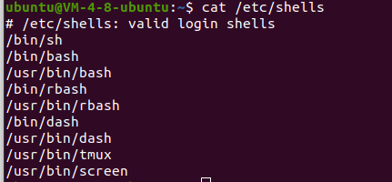
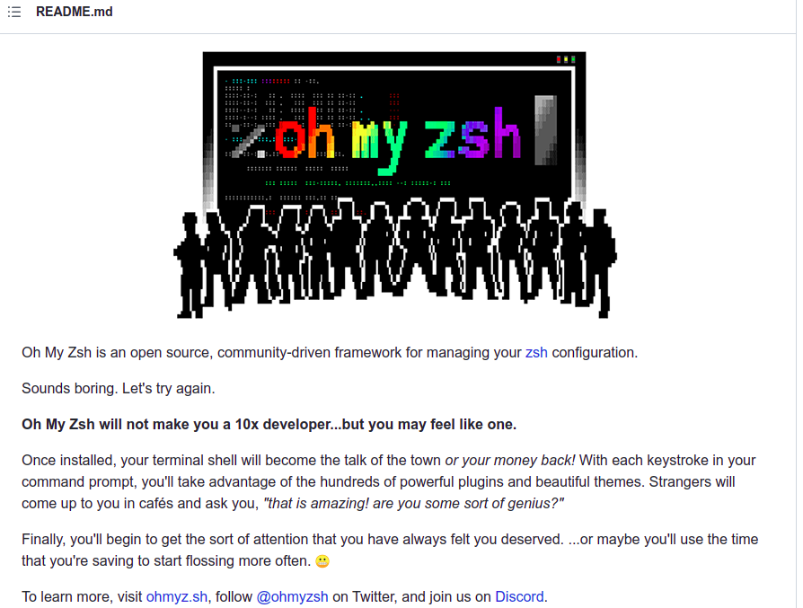
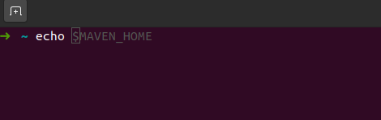

Ubuntu | 安装、配置 oh-my-zsh

<!-- more -->

​	


## 什么是 zsh

Linux 默认是 shell 是 bash shell。除去默认的 bash shell 外，存在其他的 shell。

我们可以通过查询 **/etc/shells** 文件 的内容来查询内容具有的 shell



相对于默认的 bash，zsh 就有根据高级的特性。

zsh 在使用上，和 bash shell 基本是相同的，这也是我推荐使用的理由之一；在 bash 中，我们添加配置实在 **~/.bashrc** 中，而 zsh 是在 **~/.zshrc** , 配置方法基本上是相同的，这一点和 **fish** 是不同的。

## 什么是 on-my-zsh

GitHub-oh-my-zsh

根据在 GitHub 上介绍：Oh My Zsh是一个开源、社区驱动的框架，用于管理您的Zsh配置。

更多内容，可以查询 https://github.com/ohmyzsh/ohmyzsh

## 安装

在安装 **oh-my-zsh** 前，需要先安装 **zsh**

```
sudo apt install zsh
```

通过运行以下命令将默认 **shell** 更改为 **zsh shell** 。

```
sudo chsh -s /usr/bin/fish
```

安装 on-my-zsh 具体的安装步骤：

| Method    | Command                                                      |
| --------- | ------------------------------------------------------------ |
| **curl**  | `sh -c "$(curl -fsSL https://raw.githubusercontent.com/ohmyzsh/ohmyzsh/master/tools/install.sh)"` |
| **wget**  | `sh -c "$(wget -O- https://raw.githubusercontent.com/ohmyzsh/ohmyzsh/master/tools/install.sh)"` |
| **fetch** | `sh -c "$(fetch -o - https://raw.githubusercontent.com/ohmyzsh/ohmyzsh/master/tools/install.sh)"` |

在安装安装完成

## 主题

oh-my-zsh 支持多种主题

## 插件推荐

### zsh-autosuggestions

fish 默认带了一个插件，它会根据历史记录和完成情况提示键入的命令。界面如下：



在终端输入命令行的时候后面会有浅色单词提示，如果补全满足是你想要的，按下 **Ctrl – F** 的快捷键就可以直接来补全上

安装过程如下

1. 克隆资源库到 `$ZSH_CUSTOM/plugins` (默认是  **`~/.oh-my-zsh/custom/plugins`**)

```
git clone git://github.com/zsh-users/zsh-autosuggestions $ZSH_CUSTOM/plugins/zsh-autosuggestions
```

2. 将插件添加到插件列表，让 Oh-My-Zsh 加载

修改 `~/.zshrc` 文件，找到 `plugins=(git) 这一行，然后添加` autosuggestions

```
plugins=(
    git
    zsh-autosuggestions    
)
```

3. 重新打开终端会话，或者执行 `source ~/.zshrc`也可以更新会话

一开始，我认为是没有必要的，而后面我在实际中，输入重复的命令输入太多了（我不想配置别名 alias），这个插件解决了我的需求

### autojump

```bash
sudo apt-get install autojump
```

