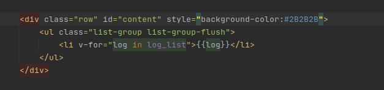

我是短小精悍的文章摘要(๑•̀ㅂ•́) ✧

<!-- more -->

在写一个前端界面时，引入了 bootstrap 库。需要修改一个带有 row 类的 div 标签的背景颜色。

按照常规的设置失败，在查询了一些资料后，最后才注意到自己的问题

下面分享一下，自己对应这个问题的历程

## 1. 最开始的设计

一开始我没有注意是 bootstrap 库影响到了 CSS3 属性的设置。后面删除了引入的 bootstrap 库后，背景颜色正确的显示出来，我才意识到是 bootstrap 库的问题

即使我在 CSS3 属性的后面添加上了 **! important** ，背景颜色仍然没有显示出来。

后面一直在查询如何设置 row 类 div 的背景颜色？(其实，查询思路错了)

## 2. 问题所在

实际上，**#content** 的 背景颜色 已经设置上了，只是没有显示出来而是，被后代标签 ul、li 遮挡住了而是，只需要让 ul、li 也设置一个背景颜色就可以了

## 3. 解决

注意：一定要设置 **!important**