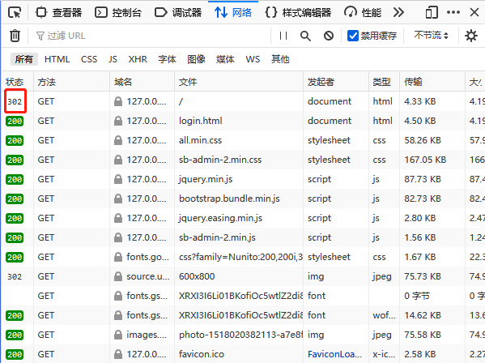
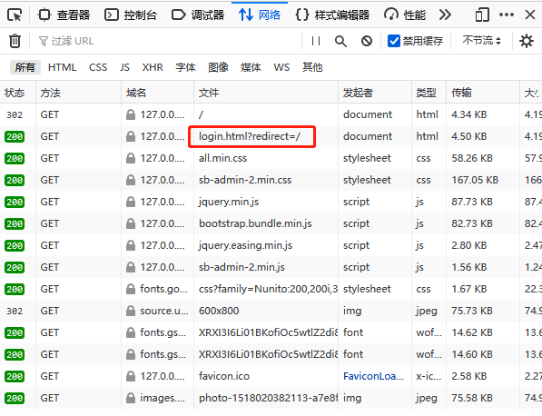

我是短小精悍的文章摘要(๑•̀ㅂ•́) ✧

<!-- more -->

实现下面的需求

*未登录访问没有权限访问的页面，重定向到登录页面后，出现一个弹窗告诉用户 ：”请先完成登录“，*

登录验证、重定向不是什么问题。关键是 ”弹窗“

PS：

## 思考

最初是想要在前端获取 http 的状态码



抱着试试的想法，查询了一下，应该是不可以了（至少我没有找到）

查询前，也认为是做不到的，至少在前端是做不到的

最后，在另外一个地方，找到了一个思路，解决了我的问题

## 解决

```
不过在重定向时，在 URL 设置一个参数 redirect，来表示 ”想要访问的“ 资源，
重定向到登录页面后，前端使用 window.location.href 获取到 URL，解析该 URL - 获取 URL 中的参数；通过判断参数 redirect 是否存在，表示是否是重定向过来的，
在用户登录完成（登录的验证使用 ajax，不要出现页面的跳转）后，跳转到预先想要访问的资源 redirect
```

这样子就解决了原来的问题。

PS: Ajax 使用起来还是方便，与服务器的数据交互更加灵活。使用 表单来向服务器提交数据，虽然也可以做到和 Ajax 相同的效果，但是不够灵活。