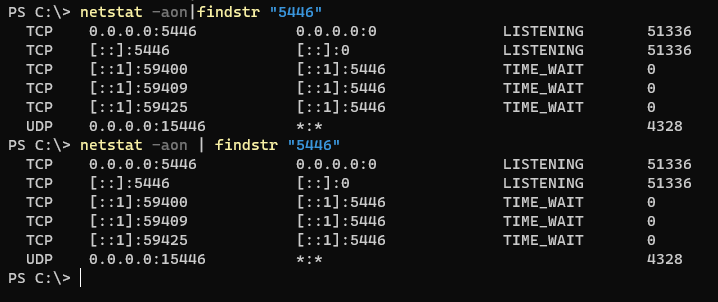
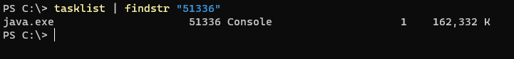
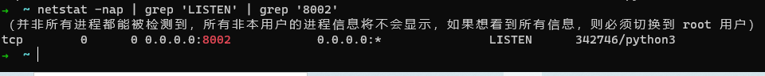
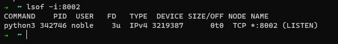
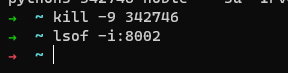
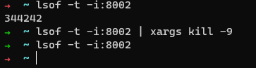
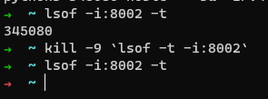

我是短小精悍的文章摘要(๑•̀ㅂ•́) ✧

<!-- more -->


## Window

```bash
netstat -aon | findstr "5446"
```

Bash

### 	查找进程对应的 PID

在 **Windows** 中，我们可以使用 **netstat** 命令找到占用端口的进程的 PID

>  PS：值得注意的是，Window 的 netstat 命令和 Linux 的 netstat 命令作用相同，但是具体的参数稍有不同。

```bash
netstat -aon | finstr '5446'
```

命令运行结果如下： 



```bash
tasklist | findstr "51336"
```

 命令运行结果如下： 



### 	杀掉进程

找到 进程 的 **PID**，下一步是使用 **taskkill** 命令杀掉进程

```
taskkill -PID <进程号> -F
```


## Linux

### 进程的 PID

```bash
netstat -anp | grep 'LISTEN' | grep '8002'
```

 命令运行结果如下： 



或者

```bash
lsof -i:8002
```

Bash



**kill** 命令杀掉进程

```bash
kill -9 
```

命令运行结果如下：



或者直接一个组成命令来完成

```bash
lsof -t -i:8002 | xargs kill -9
```



### 杀掉进程

```bash
kill -9 `lsof -t -i:8002`
```




## Mac OS

Mac Os 和 Linux 同属于 Unix，可以直接使用上面 的命令。