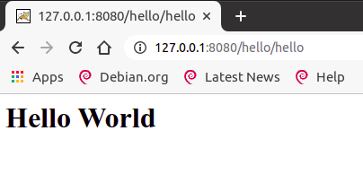

使用原生命令来构建项目

<!-- more -->

## 为什么要学习

为什么要学习要使用原生命令来构建项目

学习使用原生命令来构建项目可以帮助你深入了解 Java 编译和构建过程的底层机制，以及如何手动管理 Java 项目的依赖关系。这对于理解和解决复杂的构建问题非常有用，可以提高你的开发效率和项目管理能力。

此外，有时候你可能需要在没有 Maven 或 Gradle 等构建工具的情况下构建和部署 Java 项目。在这种情况下，了解如何使用原生命令来编译和构建 Java 项目是必不可少的技能。

另外，学习使用原生命令来构建项目可以帮助你更好地理解和使用构建工具，因为构建工具本质上是自动化执行构建任务的工具，它们使用的就是底层的命令行工具。

综上所述，学习使用原生命令来构建项目是一项有价值的技能，可以帮助你提高开发效率和项目管理能力，同时也有助于更好地理解和使用构建工具。

初学 Java 时，一般就只有一两个类，不会涉及到多个包、不会引入第三方库。

## 引言

这里介绍如何使用命令行（ `javac` 和 `java` ）来编译和运行 `java` 项目（构建 `java` 项目）

这里所谓的项目构建包括：编译、运行、测试、打包、部署（发布）等等过程

关键是 `-cp` 和 `-d` 两个参数

javac 命令

```
-cp <路径>                   指定查找用户类文件和注释处理程序的位置
-d <目录>                    指定放置生成的类文件的位置
```

java 命令

```
-cp <目录和 zip/jar 文件的类搜索路径>
```

## 项目构建

首先我们介绍使用原生的方式来构建 Java 项目，即使用 javac 、 java 、jar 等等命令。不借助 gradle、和 Maven 等等项目构建工具。

### 单个文件

项目只有一个 `java` 文件的情况下

```bash
javac HelloWorld.java  # 编译
java  HelloWorld       # 运行
```

### 涉及到包

```
javac <JavaFilePath>  	# 编译
java  <ClassPath>       # 运行
```

这里的 JavaFilePah 是 Java 文件在文件系统中的存放路径，而 ClassPath 是 Java 类在包中的路径

##### 项目介绍

项目目录结构

```
➜  Hello-Java tree
.
└── com
    └── ngsh
        └── demo
            └── HelloWorld.java
```

##### 项目构建

编译

```
javac com/ngsh/demo/HelloWorld.java
```

PS：当前目录是默认引入的，所以不需要只用 `-cp`参数来引入（当然引入也不会报错）

编译后的目录结构

```
➜  src tree
.
└── com
    └── ngsh
        └── demo
            ├── HelloWorld.class
            └── HelloWorld.java
```

运行

```
java com.ngsh.demo.HelloWorld
```

项目的起始目录就是当前目录，所以不需要使用 -cp 参数来引入

### 完整项目

作为一个完整的 Java 项目，应该包括存放源代码的目录（src）、存放生成 class 文件的目录（class）、和存放第三方库文件的目录（lib）、资源/配置文件的目录（res）等等目录

在上面所述的情况下，和上面相比命令由发生了变化

```
javac -d <ClassDir> <JavaFilePath> # 编译 (compile)
```

`-d` 参数指定生成的 class 文件的起始目录（根目录）

```
java -cp <ClassRootDir> <ClassPath>  # 运行 (run)
```

`-cp` 参数指定引入 Java 库的目录。默认是引入当前目录

`<ClassPath>`：Java 类在 Java 包中的位置

一般约定：（只是约定）

- 存放源码的目录一般用 src 命名
- 存放构建生成的 class 文件的目录一般用 classes/ build 来命名、
- 存放第三方库的目录用 lib 或者 jarlib 或者 library 等等目录来命名
- 存放配置文件/资源文件的目录一般用 res/resources 来命名

PS：值得注意的是： Tomcat 存放 class 文件的目录是 classes。而这是 Tomcat 的约定，是不能修改的

下面就一个简单的 demo 进行演示

#### 项目介绍

```
➜  Hello-Java tree
.
├── classes
├── lib
└── src
    └── com
        └── ngsh
            └── demo
                └── HelloWorld.java
```

#### 项目构建

编译

```
javac -d classes com/ngsh/demo/HelloWorld.java
```

运行

```
java -cp classes com.ngsh.demo.HelloWorld
```

这里使用 -cp 参数引入class文件起始目录


### 涉及到包和多个类

项目涉及到包，并且多个 Java 类所在的 Java 文件在不同的包结构下，满足不同的 Java Class 有依赖关系

- 编译被依赖的文件
- `-cp` 指定依赖文件的位置，编译由依赖的 `java` 文件

举例

#### 项目介绍

```
➜  Hello-Java tree
.
├── classes
└── src
    └── com
        └── ngsh
            └── demo
                └── HelloWorld.java
                └── vo
        	└── Person.java
```

PS：这里的 `HelloWorld.java` 依赖 `Person.java` 文件，src 目录是 java 文件所在的目录，classes 是生成 class 文件的位置

```
HelloWorld.java
package com.ngsh.demo;

import com.ngsh.demo.vo.Person;

public class HelloWorld{
    public static void main(String[] args){
        new Person();
    }
}
```

Java

Person.java

```java
package com.ngsh.demo.vo;

public class Person{

    private String name;
    private int age;
    
}
```

Java

#### 项目构建

##### 编译

1. 编译 Person.java 文件

Person.java 被 HelloWorld.java 所依赖，所以在编译 HelloWorld.java 文件前，要先编译

```
javac -d classes src/com/ngsh/demo/vo/Person.java
```

这里通过 -d 参数指定生成的 classes 文件的位置

\2. 编译 HelloWorld.java 文件

主要是通过 -cp 参数指定依赖的文件的位置

```
javac -cp classes  -d classes src/com/ngsh/demo/HelloWorld.java
➜  Hello-Java javac -cp classes  -d classes src/HelloWorld.java 
➜  Hello-Java tree
.
├── classes
    └── com
        └── ngsh
            └── demo
                └── HelloWorld.class
                └── vo
        	    └── Person.class
└── src
    └── com
        └── ngsh
            └── demo
                └── HelloWorld.java
                └── vo
        	    └── Person.java
```

至此，项目的编译工作已经完成

##### 运行

使用 `-cp` 参数指定起始目录

```
java -cp classes com.ngsh.demo.HelloWorld
```

### 涉及到第三方库

在这里说明，涉及到第三方库的项目的编译和运行

这里以 mysql 数据库的驱动程序 `mysql-connector-java-8.0.21.jar` 这个库举例

#### 项目结构

```
➜  Hello-Java tree
.
├── classes
├── lib
│   └── mysql-connector-java-8.0.21.jar
└── src
    └── com
        └── ngsh
            └── demo
                └── HelloWorld.java
```

HelloWorld.java

```
package com.ngsh.demo;

import java.sql.DriverManager;

public class HelloWorld{

    public static void main(String[] args)  throws Exception{
            
        Class.forName("com.mysql.cj.jdbc.Driver"); //加载MySql驱动
        DriverManager.getConnection("jdbc:mysql://127.0.0.1:3306/ta", "root", "1234567");
        
    }
}
```

#### 项目构建

##### 编译

```
javac -cp lib/mysql-connector-java-8.0.21.jar -d classes src/com/ngsh/demo/HelloWorld.java
```

##### 运行

```
java -cp lib/mysql-connector-java-8.0.21.jar:classes com.ngsh.demo.HelloWorld
```

运行时，你需要 `mysql-connector-java-8.0.21.jar` 和 项目的 class 文件，所有都需要进行引入。多个库需要使用 “:” 进行分割（本项目是在 Linux 环境下进行演示，而Window是 “;” 符号）

最后的 HelloWorld 是主类，也就是 main 方法的位置，如果 HelloWorld 是在一个包下，那么应该是 “com.ngsh.HelloWorld” ，并不是 “com/ngsh/HelloWorld”

如果，没有引入库，则会出现下面的错误

```
➜  Hello-Java java -cp classes HelloWorld                                    
Exception in thread "main" java.lang.ClassNotFoundException: com.mysql.cj.jdbc.Driver
	at java.net.URLClassLoader.findClass(URLClassLoader.java:381)
	at java.lang.ClassLoader.loadClass(ClassLoader.java:424)
	at sun.misc.Launcher$AppClassLoader.loadClass(Launcher.java:331)
	at java.lang.ClassLoader.loadClass(ClassLoader.java:357)
	at java.lang.Class.forName0(Native Method)
	at java.lang.Class.forName(Class.java:264)
	at HelloWorld.main(HelloWorld.java:7)
```

### 涉及到包和第三方库

略


## 应用

这里就使用 Tomcat ，来手动构建（编译、测试、部署、运行等等）一个 Hello World 的 Java Web 程序

在开始前，先简单介绍一下 Tomcat 服务器的目录结构

```
➜  9.0.37 tree -L 2
.
├── lib
├── webapps
```

PS：上面的树状图删去了大部分目录，只保留了下面介绍要讲解要用到的几个目录

| 目录（directory） | 介绍                                                       |
| ----------------- | ---------------------------------------------------------- |
| lib               | 库文件，这里的库文件属于第三方的库，即没有默认在 JDK 集成  |
| webapps           | 项目项目。在这个目录下的每一个目录都是一个 Java web 的项目 |

### 项目介绍

```
➜  demo-JavaWeb tree
.
├── classes
├── lib
│   └── servlet-api.jar	
├── src
│   └── com
│       └── ngsh
│           └── webDemo
│               └── HelloServlet.java
└──web.xml											 
```

servlet-api.jar 在编译需要使用 -cp 参数来引入，而在编译完成后，项目部署到 tomcat 上时，tomcat 默认提供了 servlet-api 这个库，所以不需要引入

| classes | 保存生成的 class 文件 |
| ------- | --------------------- |
| lib     | 存放第三方库          |
| src     | 存放源代码            |

目录结构介绍

| servlet-api.jar |              |
| --------------- | ------------ |
| web.xml         | 项目配置文件 |

HelloServlet.java

```
package com.ngsh;

import javax.servlet.ServletException;
import javax.servlet.http.HttpServlet;
import javax.servlet.http.HttpServletRequest;
import javax.servlet.http.HttpServletResponse;
import java.io.IOException;
import java.io.PrintWriter;

public class HelloServlet extends HttpServlet {

    @Override
    public void doGet(HttpServletRequest request, HttpServletResponse response)
            throws ServletException, IOException {
        // 设置响应内容类型
        response.setContentType("text/html");

        PrintWriter out = response.getWriter();
        out.println("<h1>" + "Hello World" + "</h1>");
    }

    @Override
    protected void doPost(HttpServletRequest request, HttpServletResponse response) throws ServletException, IOException {
        super.doPost(request, response);
        this.doGet(request, response);
    }

}
```

web.xml

```
<?xml version="1.0" encoding="UTF-8"?>
<web-app xmlns="http://xmlns.jcp.org/xml/ns/javaee"
         xmlns:xsi="http://www.w3.org/2001/XMLSchema-instance"
         xsi:schemaLocation="http://xmlns.jcp.org/xml/ns/javaee
			     http://xmlns.jcp.org/xml/ns/javaee/web-app_4_0.xsd" version="4.0" metadata-complete="true">

  <display-name>Welcome to Tomcat</display-name>
  <description>Welcome to Tomcat</description>

  <servlet>
    <servlet-name>HelloServlet</servlet-name>
    <servlet-class>com.ngsh.webDemo.HelloServlet</servlet-class>
  </servlet>

  <servlet-mapping>
    <servlet-name>HelloServlet</servlet-name>
    <url-pattern>/hello</url-pattern>
  </servlet-mapping>

</web-app>
```

严格来说，我们更多的是使用 注解 的方式来配置 servlet。这里为了引入资源文件的概念，所以使用 xml 的方式来配置 servlet

### 项目构建 

这里的项目构建过程，包含 编译、打包、部署、访问（运行）等等步骤

#### 编译

```
javac -cp lib/servlet-api.jar -d classes src/com/ngsh/webDemo/HelloServlet.java
```

编译完成后，项目会生成如图所示的目录结构

```
➜  demo-JavaWeb tree
.
├── classes
├── lib
│   └── servlet-api.jar			# servlet-api
├── src
│   └── com
│       └── ngsh
│           └── webDemo
│               └── HelloServlet.java
└──       web.xml											 # 配置文件
```

#### 打包

这里的打包是指 war包，此步骤可以忽略

#### 部署

在本地编译完成项目后，需要部署到远程的服务器上

在 webapp 的目录下创建一个应用（application）Hello，并在其下创建如下所示的目录结构

```
➜  hello tree
.
└── WEB-INF
    ├── classes
    └── web.xml
```

拷贝本地项目的 classes 目录，web.xml 文件替换上面的目录

#### 运行

Tomcat 的运行不需要我们来使用 `java` 命令来运行，直接在浏览器访问即可

访问结果如下：



在下一篇文章中，我将简单介绍一下 Java 的项目构建工具，尝试解释下面的问题

- 什么是项目构建工具？
- 项目构建工具为我们做了什么？
- …..