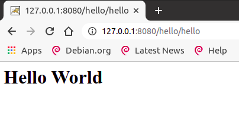

我是短小精悍的文章摘要(๑•̀ㅂ•́) ✧

<!-- more -->

初学 Java 时，一般就只有一两个类，不会涉及到多个包、不会引入第三方库。

## 引言

这里介绍如何使用命令行（ `javac` 和 `java` ）来编译和运行 `java` 项目（构建 `java` 项目）

这里所谓的项目构建包括：编译、运行、测试、打包、部署（发布）等等过程

关键是 `-cp` 和 `-d` 两个参数

javac 命令

```
-cp <路径>                   指定查找用户类文件和注释处理程序的位置
-d <目录>                    指定放置生成的类文件的位置
```


java 命令

```
-cp <目录和 zip/jar 文件的类搜索路径>
```


## 项目构建

首先我们介绍使用原生的方式来构建 Java 项目，即使用 javac 、 java 、jar 等等命令。不借助 gradle、和 Maven 等等项目构建工具。

### 单个文件

项目只有一个 `java` 文件的情况下

```bash
javac HelloWorld.java  # 编译
java  HelloWorld       # 运行
```

Bash

### 涉及到包

```
javac <JavaFilePath>  	# 编译
java  <ClassPath>       # 运行
```

这里的 JavaFilePath 是 Java 文件在文件系统中的存放路径，而 ClassPath 是 Java 类在包中的路径

- 项目介绍

项目目录结构

```
➜  Hello-Java tree
.
└── com
    └── ngsh
        └── demo
            └── HelloWorld.java
```

- 项目构建

编译

```
javac com/ngsh/demo/HelloWorld.java
```

PS：当前目录是默认引入的，所以不需要只用 `-cp`参数来引入（当然引入也不会报错）

编译后的目录结构

```
➜  src tree
.
└── com
    └── ngsh
        └── demo
            ├── HelloWorld.class
            └── HelloWorld.java
```

运行

```
java com.ngsh.demo.HelloWorld
```

项目的起始目录就是当前目录，所以不需要使用 -cp 参数来引入

### 完整项目

作为一个完整的 Java 项目，应该包括存放源代码的目录（src）、存放生成 class 文件的目录（class）、和存放第三方库文件的目录（lib）、资源/配置文件的目录（res）等等目录

在上面所述的情况下，和上面相比命令由发生了变化

```
javac -d <ClassDir> <JavaFilePath> # 编译 (compile)
```

`-d` 参数指定生成的 class 文件的起始目录（根目录）

```
java -cp <ClassRootDir> <ClassPath>  # 运行 (run)
```

`-cp` 参数指定引入 Java 库的目录。默认是引入当前目录

`<ClassPath>`：Java 类在 Java 包中的位置

一般约定：（只是约定）

- 存放源码的目录一般用 src 命名
- 存放构建生成的 class 文件的目录一般用 classes/ build 来命名、
- 存放第三方库的目录用 lib 或者 jarlib 或者 library 等等目录来命名
- 存放配置文件/资源文件的目录一般用 res/resources 来命名

PS：值得注意的是： Tomcat 存放 class 文件的目录是 classes。而这是 Tomcat 的约定，是不能修改的

下面就一个简单的 demo 进行演示

#### 项目介绍

```
➜  Hello-Java tree
.
├── classes
├── lib
└── src
    └── com
        └── ngsh
            └── demo
                └── HelloWorld.java
```

#### 项目构建

编译

```
javac -d classes com/ngsh/demo/HelloWorld.java
```

运行

```
java -cp classes com.ngsh.demo.HelloWorld
```

这里使用 -cp 参数引入class文件起始目录


### 涉及到包和多个类

项目涉及到包，并且多个 Java 类所在的 Java 文件在不同的包结构下，满足不同的 Java Class 有依赖关系

- 编译被依赖的文件
- `-cp` 指定依赖文件的位置，编译由依赖的 `java` 文件

举例

#### 项目介绍

```
➜  Hello-Java tree
.
├── classes
└── src
    └── com
        └── ngsh
            └── demo
                └── HelloWorld.java
                └── vo
        	└── Person.java
```

PS：这里的 `HelloWorld.java` 依赖 `Person.java` 文件，src 目录是 java 文件所在的目录，classes 是生成 class 文件的位置

```
HelloWorld.java
package com.ngsh.demo;

import com.ngsh.demo.vo.Person;

public class HelloWorld{
    public static void main(String[] args){
        new Person();
    }
}
```

Java

Person.java

```java
package com.ngsh.demo.vo;

public class Person{

    private String name;
    private int age;
    
}
```

Java

#### 项目构建

##### 编译

1. 编译 Person.java 文件

Person.java 被 HelloWorld.java 所依赖，所以在编译 HelloWorld.java 文件前，要先编译

```
javac -d classes src/com/ngsh/demo/vo/Person.java
```

这里通过 -d 参数指定生成的 classes 文件的位置

\2. 编译 HelloWorld.java 文件

主要是通过 -cp 参数指定依赖的文件的位置

```
javac -cp classes  -d classes src/com/ngsh/demo/HelloWorld.java
➜  Hello-Java javac -cp classes  -d classes src/HelloWorld.java 
➜  Hello-Java tree
.
├── classes
    └── com
        └── ngsh
            └── demo
                └── HelloWorld.class
                └── vo
        	    └── Person.class
└── src
    └── com
        └── ngsh
            └── demo
                └── HelloWorld.java
                └── vo
        	    └── Person.java
```

至此，项目的编译工作已经完成

##### 运行

使用 `-cp` 参数指定起始目录

```
java -cp classes com.ngsh.demo.HelloWorld
```

### 涉及到第三方库

在这里说明，涉及到第三方库的项目的编译和运行

这里以 mysql 数据库的驱动程序 `mysql-connector-java-8.0.21.jar` 这个库举例

#### 项目结构

```
➜  Hello-Java tree
.
├── classes
├── lib
│   └── mysql-connector-java-8.0.21.jar
└── src
    └── com
        └── ngsh
            └── demo
                └── HelloWorld.java
```

HelloWorld.java

```
package com.ngsh.demo;

import java.sql.DriverManager;

public class HelloWorld{

    public static void main(String[] args)  throws Exception{
            
        Class.forName("com.mysql.cj.jdbc.Driver"); //加载MySql驱动
        DriverManager.getConnection("jdbc:mysql://127.0.0.1:3306/ta", "root", "1234567");
        
    }
}
```

#### 项目构建

##### 编译

```
javac -cp lib/mysql-connector-java-8.0.21.jar -d classes src/com/ngsh/demo/HelloWorld.java
```

##### 运行

```
java -cp lib/mysql-connector-java-8.0.21.jar:classes com.ngsh.demo.HelloWorld
```

运行时，你需要 `mysql-connector-java-8.0.21.jar` 和 项目的 class 文件，所有都需要进行引入。多个库需要使用 “:” 进行分割（本项目是在 Linux 环境下进行演示，而Window是 “;” 符号）

最后的 HelloWorld 是主类，也就是 main 方法的位置，如果 HelloWorld 是在一个包下，那么应该是 “com.ngsh.HelloWorld” ，并不是 “com/ngsh/HelloWorld”

如果，没有引入库，则会出现下面的错误

```
➜  Hello-Java java -cp classes HelloWorld                                    
Exception in thread "main" java.lang.ClassNotFoundException: com.mysql.cj.jdbc.Driver
	at java.net.URLClassLoader.findClass(URLClassLoader.java:381)
	at java.lang.ClassLoader.loadClass(ClassLoader.java:424)
	at sun.misc.Launcher$AppClassLoader.loadClass(Launcher.java:331)
	at java.lang.ClassLoader.loadClass(ClassLoader.java:357)
	at java.lang.Class.forName0(Native Method)
	at java.lang.Class.forName(Class.java:264)
	at HelloWorld.main(HelloWorld.java:7)
```

### 涉及到包和第三方库

略


## 应用

这里就使用 Tomcat ，来手动构建（编译、测试、部署、运行等等）一个 Hello World 的 Java Web 程序

在开始前，先简单介绍一下 Tomcat 服务器的目录结构

```
➜  9.0.37 tree -L 2
.
├── lib
├── webapps
```

PS：上面的树状图删去了大部分目录，只保留了下面介绍要讲解要用到的几个目录

| 目录（directory） | 介绍                                                       |
| ----------------- | ---------------------------------------------------------- |
| lib               | 库文件，这里的库文件属于第三方的库，即没有默认在 JDK 集成  |
| webapps           | 项目项目。在这个目录下的每一个目录都是一个 Java web 的项目 |

### 项目介绍

```
➜  demo-JavaWeb tree
.
├── classes
├── lib
│   └── servlet-api.jar	
├── src
│   └── com
│       └── ngsh
│           └── webDemo
│               └── HelloServlet.java
└──web.xml											 
```

servlet-api.jar 在编译需要使用 -cp 参数来引入，而在编译完成后，项目部署到 tomcat 上时，tomcat 默认提供了 servlet-api 这个库，所以不需要引入

| classes | 保存生成的 class 文件 |
| ------- | --------------------- |
| lib     | 存放第三方库          |
| src     | 存放源代码            |

目录结构介绍

| servlet-api.jar |              |
| --------------- | ------------ |
| web.xml         | 项目配置文件 |

HelloServlet.java

```
package com.ngsh;

import javax.servlet.ServletException;
import javax.servlet.http.HttpServlet;
import javax.servlet.http.HttpServletRequest;
import javax.servlet.http.HttpServletResponse;
import java.io.IOException;
import java.io.PrintWriter;

public class HelloServlet extends HttpServlet {

    @Override
    public void doGet(HttpServletRequest request, HttpServletResponse response)
            throws ServletException, IOException {
        // 设置响应内容类型
        response.setContentType("text/html");

        PrintWriter out = response.getWriter();
        out.println("<h1>" + "Hello World" + "</h1>");
    }

    @Override
    protected void doPost(HttpServletRequest request, HttpServletResponse response) throws ServletException, IOException {
        super.doPost(request, response);
        this.doGet(request, response);
    }

}
```

web.xml

```
<?xml version="1.0" encoding="UTF-8"?>
<web-app xmlns="http://xmlns.jcp.org/xml/ns/javaee"
         xmlns:xsi="http://www.w3.org/2001/XMLSchema-instance"
         xsi:schemaLocation="http://xmlns.jcp.org/xml/ns/javaee
			     http://xmlns.jcp.org/xml/ns/javaee/web-app_4_0.xsd" version="4.0" metadata-complete="true">

  <display-name>Welcome to Tomcat</display-name>
  <description>Welcome to Tomcat</description>

  <servlet>
    <servlet-name>HelloServlet</servlet-name>
    <servlet-class>com.ngsh.webDemo.HelloServlet</servlet-class>
  </servlet>

  <servlet-mapping>
    <servlet-name>HelloServlet</servlet-name>
    <url-pattern>/hello</url-pattern>
  </servlet-mapping>

</web-app>
```

严格来说，我们更多的是使用 注解 的方式来配置 servlet。这里为了引入资源文件的概念，所以使用 xml 的方式来配置 servlet

### 项目构建 

这里的项目构建过程，包含 编译、打包、部署、访问（运行）等等步骤

#### 编译

```
javac -cp lib/servlet-api.jar -d classes src/com/ngsh/webDemo/HelloServlet.java
```

编译完成后，项目会生成如图所示的目录结构

```
➜  demo-JavaWeb tree
.
├── classes
├── lib
│   └── servlet-api.jar			# servlet-api
├── src
│   └── com
│       └── ngsh
│           └── webDemo
│               └── HelloServlet.java
└──       web.xml											 # 配置文件
```

#### 打包

这里的打包是指 war包，此步骤可以忽略

#### 部署

在本地编译完成项目后，需要部署到远程的服务器上

在 webapp 的目录下创建一个应用（application）Hello，并在其下创建如下所示的目录结构

```
➜  hello tree
.
└── WEB-INF
    ├── classes
    └── web.xml
```

拷贝本地项目的 classes 目录，web.xml 文件替换上面的目录

#### 运行

Tomcat 的运行不需要我们来使用 `java` 命令来运行，直接在浏览器访问即可

访问结果如下：



在下一篇文章中，我将简单介绍一下 Java 的项目构建工具，尝试解释下面的问题

- 什么是项目构建工具？
- 项目构建工具为我们做了什么？
- …..