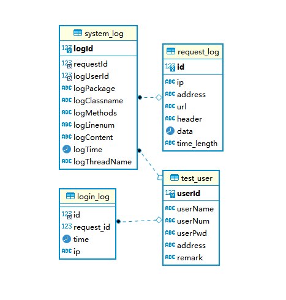

(๑•̀ㅂ•́) ✧ Java-日志信息表的设计

<!-- more -->

## 引言

这里对 Java 的日志信息进行，建立的三张表用于统计日志信息。

下面主要介绍数据库中日志相关表的设计

> Log4J 日志框架可以直接和 JDBC 集成，用于相关日志信息的保存，这里不做介绍
>
> 这里提供了另外一种简单的方案

## 表结构

E-R 图



设计到上面的四张表

| 序号 | 表名称      | 表描述               |
| ---- | ----------- | -------------------- |
| 1    | login_log   | 用户的登录日志信息表 |
| 2    | request_log | 用户请求日志信息表   |
| 3    | system_log  | 系统运行的日志信息表 |

除去上面四张表外，还有一张额外的 **用户信息表** 

完成的建表语句如下：

```sql
CREATE TABLE `test_user` (
  `userId` int NOT NULL COMMENT '用户编号 主键',
  `userName` varchar(100) DEFAULT NULL COMMENT '用户昵称',
  `userNum` varchar(100) DEFAULT NULL COMMENT '用户帐号',
  `userPwd` varchar(100) DEFAULT NULL COMMENT '用户密码',
  `address` varchar(100) DEFAULT NULL COMMENT '用户地址',
  `remark` varchar(100) DEFAULT NULL COMMENT '用户备注',
  PRIMARY KEY (`userId`)
) ENGINE=InnoDB DEFAULT CHARSET=utf8mb4 COLLATE=utf8mb4_0900_ai_ci COMMENT='用户信息表';

CREATE TABLE `login_log` (
  `id` int DEFAULT NULL COMMENT '主键ID',
  `request_id` int DEFAULT NULL COMMENT 'http 请求 id 外键',
  `time` datetime DEFAULT NULL COMMENT '登录时间',
  `ip` varchar(100) DEFAULT NULL COMMENT '登录的 IP 地址',
  KEY `login_log_FK` (`id`),
  CONSTRAINT `login_log_FK` FOREIGN KEY (`id`) REFERENCES `test_user` (`userId`)
) ENGINE=InnoDB DEFAULT CHARSET=utf8mb4 COLLATE=utf8mb4_0900_ai_ci COMMENT='用户的登录日志信息表';

CREATE TABLE `request_log` (
  `id` int NOT NULL COMMENT '主键ID',
  `ip` varchar(100) CHARACTER SET utf8mb4 COLLATE utf8mb4_0900_ai_ci DEFAULT NULL COMMENT '请求的客户端Ip',
  `address` varchar(100) CHARACTER SET utf8mb4 COLLATE utf8mb4_0900_ai_ci DEFAULT NULL COMMENT '请求 ip 对应的物理地址',
  `url` varchar(100) CHARACTER SET utf8mb4 COLLATE utf8mb4_0900_ai_ci DEFAULT NULL COMMENT '请求的路径信息',
  `header` varchar(100) DEFAULT NULL COMMENT '请求头',
  `data` datetime DEFAULT NULL COMMENT '请求时间',
  `time_length` varchar(100) DEFAULT NULL COMMENT '请求的时间长度',
  PRIMARY KEY (`id`)
) ENGINE=InnoDB DEFAULT CHARSET=utf8mb4 COLLATE=utf8mb4_0900_ai_ci COMMENT='用户请求日志信息表';

CREATE TABLE `system_log` (
  `logId` int NOT NULL COMMENT '日志id',
  `requestId` int DEFAULT NULL COMMENT 'http 请求 id（外键）',
  `logUserId` int DEFAULT NULL COMMENT '日志用户ID（外键）',
  `logPackage` varchar(100) DEFAULT NULL COMMENT '日志所在的包名',
  `logClassname` varchar(100) DEFAULT NULL COMMENT '日志的类名',
  `logMethods` varchar(100) DEFAULT NULL COMMENT '日志的方法名称',
  `logLinenum` varchar(100) DEFAULT NULL COMMENT '打印日志的行号',
  `logContent` varchar(100) DEFAULT NULL COMMENT '日志的内容',
  `logTime` datetime DEFAULT NULL COMMENT '日志的时间',
  `logThreadName` varchar(100) DEFAULT NULL COMMENT '线程名称',
  PRIMARY KEY (`logId`),
  KEY `system_log_FK` (`logUserId`),
  KEY `system_log_FK_1` (`requestId`),
  CONSTRAINT `system_log_FK` FOREIGN KEY (`logUserId`) REFERENCES `test_user` (`userId`),
  CONSTRAINT `system_log_FK_1` FOREIGN KEY (`requestId`) REFERENCES `request_log` (`id`)
) ENGINE=InnoDB DEFAULT CHARSET=utf8mb4 COLLATE=utf8mb4_0900_ai_ci COMMENT='系统运行的日志信息表';
```

## 日志的收集和保存

- http 请求日志信息的收集和保存
- 系统运行日志信息的收集和保存
- 用户登录信息的收集和保存

> 下面省略了 service、dao、entity 层相关的代码

首先定义了一个 日志工具类，主要完成两个工作

- 日志的输出
- 日志的保存

```java
public class LogManager {

    /**
     * log4j
     */
    private Logger log = null;

    public LogManager() {
    }

    public LogManager(Class<?> clazz){
        this.log =  org.apache.logging.log4j.LogManager.getLogger(clazz);
    }

    // ... 省略部分方法

    public void info(String format, Object... arguments){
		// 省略
        log.info(format,arguments);
        // 执行保存数据库
    }
    public void info(String msg){
        StackTraceElement stackTraceElement = (StackTraceElement)Thread.currentThread().getStackTrace()[2];
        String threadName = Thread.currentThread().getName();
        String methodName = stackTraceElement.getMethodName();
        String className = stackTraceElement.getClassName();
        Integer lineNum = stackTraceElement.getLineNumber();
        String moduleName = stackTraceElement.getMethodName();
        // 执行保存数据库
        log.info(msg);
    }

	// .. 省略部分方法
}
```

> 上面省略了部分方法，如 **debug**

主要是对 **Logger** （org.apache.logging.log4j）类中的部分方法的重写，同时进行日志的保存

### http 请求日志信息

这里定义了一个拦截器用于对 http 请求的日志信息的统计

```java
package com.example.example.interceptor;

/**
 * @author wangsh
 * @date 2022/5/25 4:59
 */

@Component
public class CommonInterceptor extends LogManager implements HandlerInterceptor {

    public CommonInterceptor() {
    }

    @Override
    public boolean preHandle(HttpServletRequest request, HttpServletResponse response, Object handler) throws Exception {
        request.setAttribute("http_id",UUID.randomUUID().toString().replace("-","")); // 主键 id
        request.setAttribute("stime",System.currentTimeMillis());  // 开始时间

        return HandlerInterceptor.super.preHandle(request, response, handler);
    }

    @Override
    public void postHandle(HttpServletRequest request, HttpServletResponse response, Object handler, ModelAndView modelAndView) throws Exception {
        HandlerInterceptor.super.postHandle(request, response, handler, modelAndView);
    }

    @Override
    public void afterCompletion(HttpServletRequest request, HttpServletResponse response, Object handler, Exception ex) throws Exception {

        long stime = (long)request.getAttribute("stime");
        long etime = System.currentTimeMillis();  // 结束时间
	   // ... 执行保存数据库操作
        HandlerInterceptor.super.afterCompletion(request, response, handler, ex);
    }
}

```

拦截器的配置

```java
package com.example.example.config;

/**
 * @author wangsh
 * @date 2022/4/29 14:21
 */

@Configuration
public class MyMvcConfig implements WebMvcConfigurer {
    // ......
    @Override
    public void addInterceptors(InterceptorRegistry registry) {
        registry.addInterceptor(new CommonInterceptor())
                .addPathPatterns("/**");
    }
}

```

### 统计系统运行日志

这部分需要结合上面的拦截器

创建 **controller** 层基类

```java
package com.example.example.controller;

import com.example.example.LogManager;

/**
 * @author wangsh
 * @date 2022/5/25 15:17
 */

public class BaseController {

    protected LogManager log = null;

    public BaseController() {
    }

    public BaseController(Class aClass) {
        this.log = new LogManager(aClass);;
    }
}

```

创建测试的 controller 类

```java
@RestController
public class HelloController extends BaseController{

    private Integer http_id;

    public HelloController() {
        super(HelloController.class);
    }

    @ModelAttribute
    public void setReqAndRes(HttpServletRequest request) {
        this.http_id = (Integer) request.getAttribute("http_id");;
    }

    @RequestMapping(value = "/hello")
    public String hello(){
        this.log.info("调用方法1");
        // 执行保存数据库的操作
        return "String";
    }
}

```

### 用户登录信息

略

