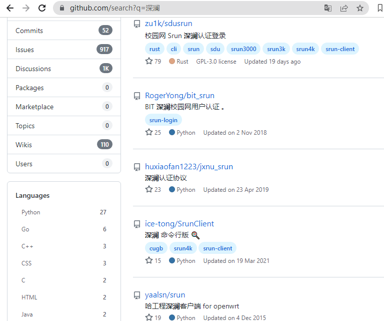

终端登录浏览器认证

<!-- more --> 

网络情况如下；

- **只提供**浏览器的方式，来完成登录认证（如 **深澜软件**），没有其它登录方式

角色

- 认证服务器
- 远程服务器（只有 **字符界面**）
- 本地计算机（有**图形界面**）

在电脑有 **图形用户界面** 这个是方便的，而对于那种 只有**字符界面** （文本界面接口）的服务器而言，一般情况下是无法使用浏览器来完成登录的

下面介绍几种方案

- 浏览器请求流程分析
- 代理服务器
- 终端浏览器

## 浏览器请求流程分析

通过分析浏览器的登录过程，来编写脚本（如 Python 脚本）来模拟浏览器登录过程

> 这需要一定的编程经验，和对 http 协议有一定的基础

比如 **深澜软件** 的脚本，就可以在 **Github** 上注意到有很多人写过相关脚本



> Python、Rust、Go 等等都有实现的

## 代理服务器

解决方法：配置 **远程服务器** 为 **代理服务器**，本地电脑配置代理，让流量从 **代理服务器** 走，这样在 **本地电脑** 的操作也会被 **认证服务器** 认为是 **远程服务器** 的操作

### 具体实现

介绍完成原理，下面使用 **ssh** 来完成动态代理，当然你也可以使用其它工具来完成代理（原理相同即可）

服务器配置

```bash
ssh -D 10001 admin@10.0.8.3
```

> ssh 动态代理，

本地电脑配置

配置代理在 **10.0.8.3** 的 **10001** 端口

即可直接在配置有代理的本地电脑，打开浏览器为远程的服务器进行认证登录，在认证服务器看来，本地计算机的所有操作都是 服务器来进行了

> ssh 动态代理的应用之一

## 终端浏览器

> 不一定可以，没有尝试过

**w3m**是一个可以在 **终端** 运行的浏览器