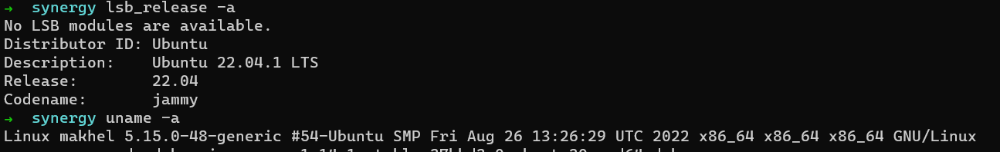
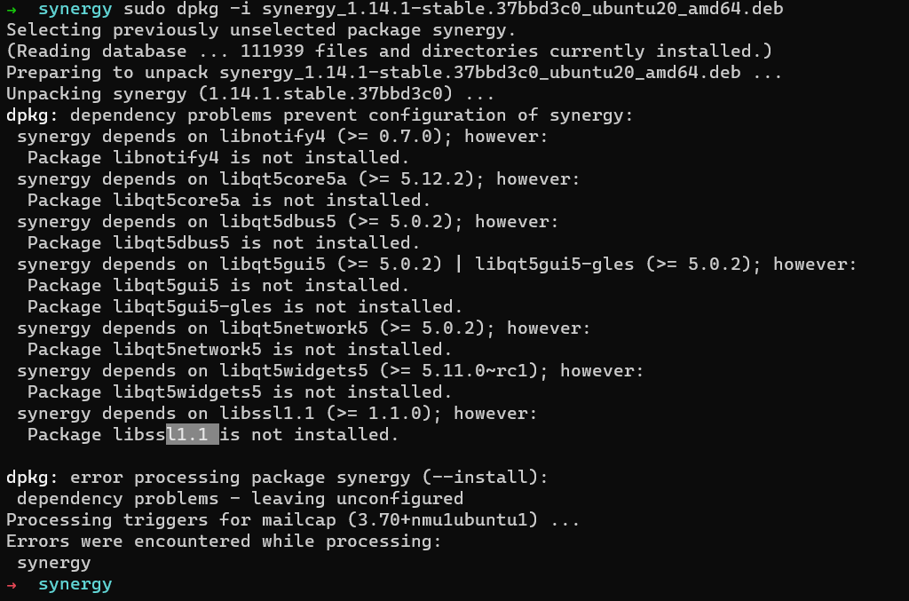
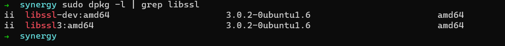
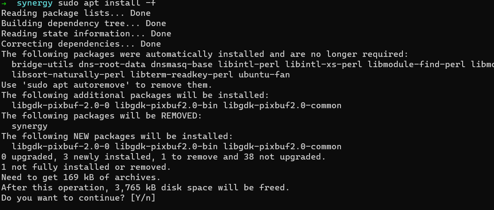
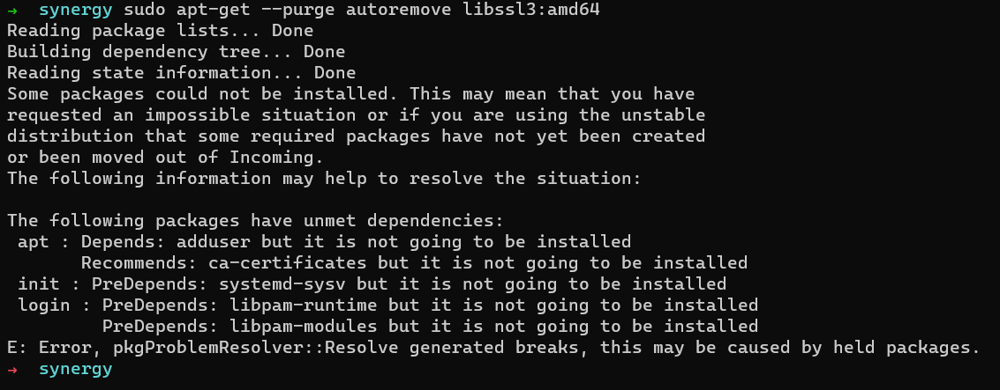

Linux | 依赖缺失问题

<!-- more --> 

在 **debain** 系列的 Linux 发行版中， 在使用 **dpkg** 命令安装 **deb** 文件，可能会出现依赖缺失的问题

下面分享一下个人的见解

> 推荐看一下这个 [知乎-史上最硬核的 Linux 依赖问题解决方案](https://zhuanlan.zhihu.com/p/137948822)

出现依赖问题的主要原因是两种

- 缺失所需要的依赖
- 或者需要依赖的版本和系统已安装的版本有冲突

按照报错的信息，可能让你在终端实现下面的命令来尝试解决依赖问题

```bash
sudo apt install -f
# 或者
```

> 这个命令可以解决大部分依赖缺失的问题

运行这个命令，APT 会尝试为你解决这个问题，解决的方案有两种

- 补全这个软件的所缺失依赖列表（优先考虑）
- 删除这个软件

如果是 **缺失所需要的依赖** ，**APT** 会尝试为你安装依赖，如果是 **版本有冲突**，**APT** 会删除这个无法补全依赖的库（这个软件）

## 举例

之前，我重新安装了 **Ubuntu22.04**，需要安装 **Synergy** [^1]，当时我电脑上暂时只有一份  **Ubuntu20.04** 的 **deb** 安装包，在尝试安装后，出现了下面的问题





缺少这个库 （libssl1.1）的依赖，这个库在 Ubuntu22.04 中版本已经变化了，这个库在 **Ubuntu22.04** 中已经变成了 libssl3



当我尝试使用 **APT** 来解决这个依赖时



**APT** 无法解决这个依赖，就询问我们是否删除这个 **synergy**

当我们尝试使用 **APT** 或者 **dpkg** 来删除 **libssl3** 这个库时，这个库被多个库依赖



我们可以尝试来手动解决这个依赖问题

> 不是很推荐，容易出现问题，**很可能会破坏现有的程序依赖结构**。

在 **Ubuntu** 的 **APT** 仓库中，这个版本的库已经被移除了，我们依旧可以在网上找到这个库的先前版本，并尝试卸载本地的版本，安装一个老版本的。

- [https://packages.ubuntu.com/](https://packages.ubuntu.com/)
- [https://www.debian.org/distrib/packages](https://www.debian.org/distrib/packages)
- 等等。

值得注意的是，上面的方法是有可能解决这个问题，但是个人不推荐去这样做，因为系统可能因为你的这个举动而 **崩溃**  [^2]

最好的解决思路还是重新下载一个针对 **ubuntu22.04** 这个版本的软件

> 或者使用  **appImage**，**snap**，**flatpak**  这种把依赖打包到一起这个格式（并不一定有这种格式）

<hr>

[^1]: 一款跨平台的的鼠标键盘共享软件，以软件的方式实现多台不同设备共享同一套鼠标键盘

[^2]: 我个人遇到的一种情况是: 删除 vlc-data 这个库是时候，导致 Deepin 的桌面环境(dde)被删除

[^3]:此时，你会想要为什么想要 appImage，snap，flatpak 等等这类把依赖打包到依赖这种格式

