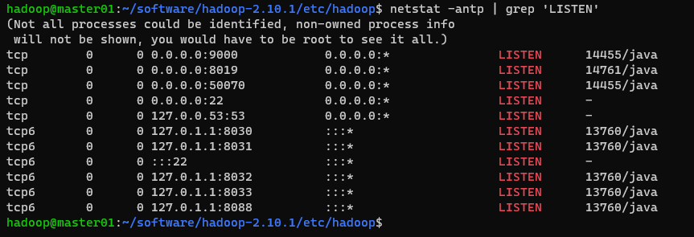

如何设置 Hadoop 50070 端口绑定的地址、如何允许非本机 ip 访问 Hadoop 的 50070 端口

<!-- more --> 

修改 `hdfs-site.xml`，添加下面内容

```xml
<property>
    <name>dfs.client.use.datanode.hostname</name>
    <value>true</value>
</property>
<property>
    <name>dfs.namenode.rpc-bind-host</name>
    <value>0.0.0.0</value>
</property>
<property>
    <name>dfs.namenode.servicerpc-bind-host</name>
    <value>0.0.0.0</value>
</property>
<property>
    <name>dfs.namenode.http-bind-host</name>
    <value>0.0.0.0</value>
</property>
<property>
    <name>dfs.namenode.https-bind-host</name>
    <value>0.0.0.0</value>
</property>
```

这将允许`Hadoop`绑定到所有可用的网络接口，而不仅仅是本地主机。

```bash
netstat -antp | grep 'LISTEN'
```

