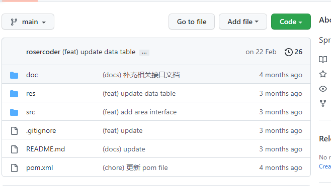

我是短小精悍的文章摘要(๑•̀ㅂ•́) ✧

<!-- more --> 

**Github** 上显示的 **Author**  信息是如何确定的？

结论：Commit 提交的信息是根据 在本地配置的 **email**  信息确定的，根据本地配置的 **Email** 查询到的 **username**

当我在另外一台电脑上，push 自己修改的代码，这里显示的 **username** 的本地的 **Email** 在 Github 对应的值，当我修改 **username** 的值，不会有变化。

只有修改 **Email** 的值，**Author** 才会发生变化。