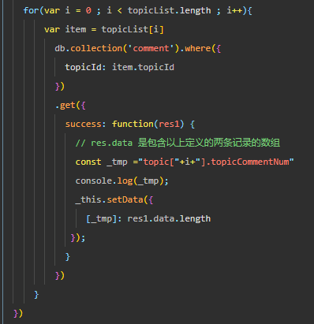
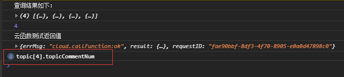
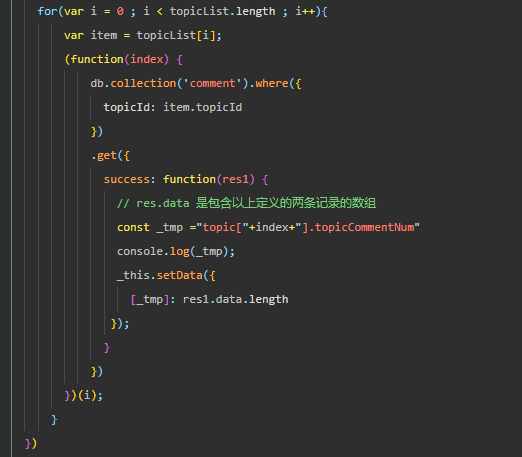
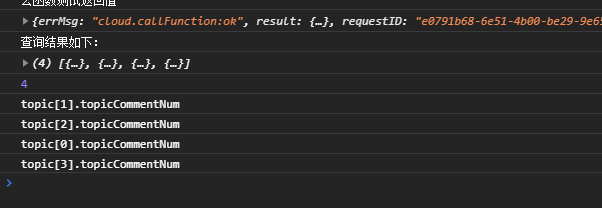

我是短小精悍的文章摘要(๑•̀ㅂ•́) ✧

<!-- more -->

下面以 **微信小程序** 开发的代码为例

## 问题描述

在微信小程序云开发中，如果需要循环一个数组，并在每一次循环中执行一次数据库操作，会出现异步执行的问题。

- 相关代码如下：

- 控制台输出如下：

## 解决思路

定义一个函数，函数有一个参数，在每一次循环中，调用这个函数，并把循环的 i 作为参数传入进去

> 函数只在同一个地方调用，因此我这里使用了一个自执行匿名函数，来完成功能模块

程序运行输出如下：

