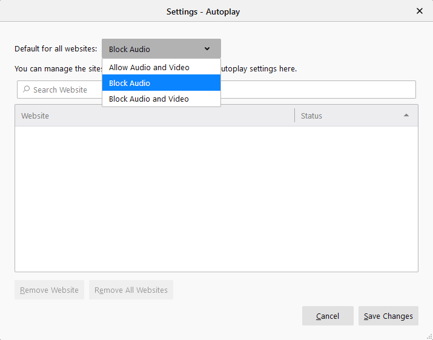
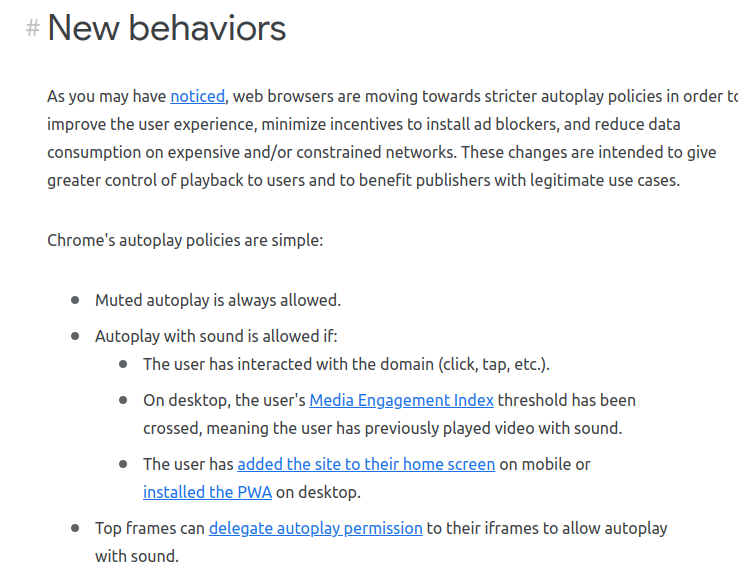

我是短小精悍的文章摘要(๑•̀ㅂ•́) ✧

<!-- more -->

浏览器的自动播放策略，就是浏览器如何处理网页中的音视频资源 – 即是否允许播放。

不同的浏览器 **自动播放策略** 是不同的，下面就常见的浏览器

## Firefox

[[官方\] Firefox 浏览器自动播放策略](https://support.mozilla.org/zh-CN/kb/Firefox的媒体自动播放设置)

Firefox 默认禁止网站自动播放音频文件，允许视频自动播放。

我们可以在 设置 -> 隐私与安全 -> 权限 -> 自动播放 中设置

## Chrome

[[官方\] Chrome 自动播放策略](https://developer.chrome.com/blog/autoplay/)

web浏览器正朝着更严格的自动播放政策发展，以改善用户体验，最大限度地减少安装广告拦截器的动机，并减少昂贵和/或受限网络上的数据消耗。这些更改旨在为用户提供更大的播放控制权，并使具有合法用例的出版商受益。

简单来说：

- 视频允许静音播放
- 自动播放音频在某些条件下被允许
  1. 用户已与域进行了交互 : 简单来说，就是用户在网页上进行了操作，如点击等等
  2. 用户的媒体参与度指数阈值已经超过，这意味着用户以前播放过有声音的视频。(用户频繁访问的网站允许自动播放)
  3. 用户已将该网站添加到移动设备的主屏幕上，或在桌面上安装了PWA。
- 顶部框架(Top Frame)可以将自动播放权限委托给其iFrame，以允许自动播放声音。（父 Frame，子 Frame 允许自动播放）